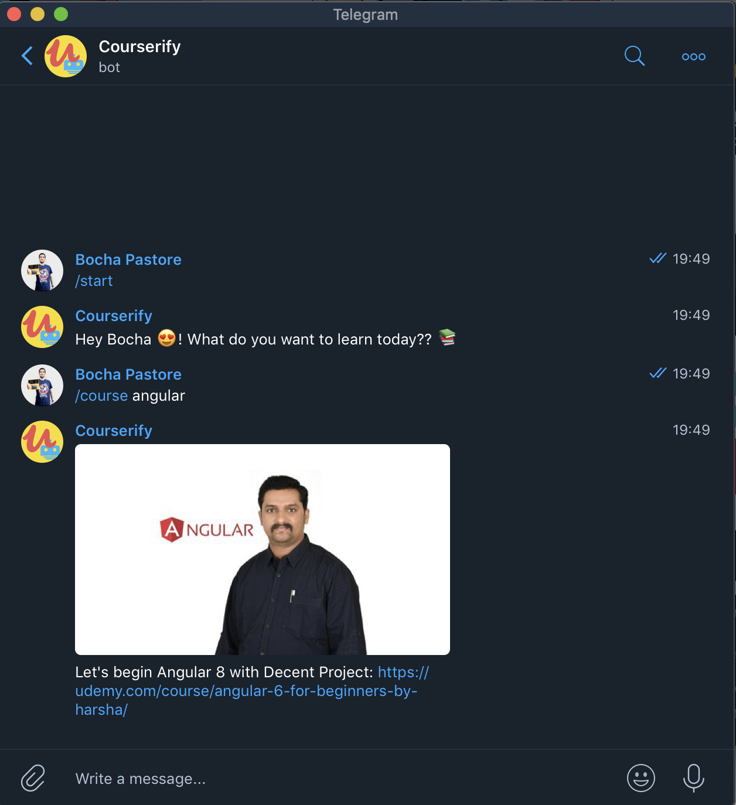

# Courserify Bot 🤖



## Usage

```javascript
// Start the bot
/start
```

```javascript
// Get a course
/course <query>
```

## Installation

- Create your bot using [BotFather](https://core.telegram.org/bots#3-how-do-i-create-a-bot)
- Clone this repo `git clone https://github.com/martinpastore/courserify_bot.git`
- Install dependencies `npm install`
- Get your Udemy developer credentials from [Udemy Clients API ](https://www.udemy.com/user/edit-api-clients/) page.
- Create your `.env` file and set the following variables:
```bash
BOT_TOKEN="YOUR_BOT_TOKEN"
UDEMY_AUTHORIZATION="YOUR_UDEMY_TOKEN"
```
_Udemy's authorization is the result of `client_id:client_secret` encoded on base64_

- Run `npm start` and go to telegram to test it 😄

## Contributions

Send me a PR, I love the improvements 😍
